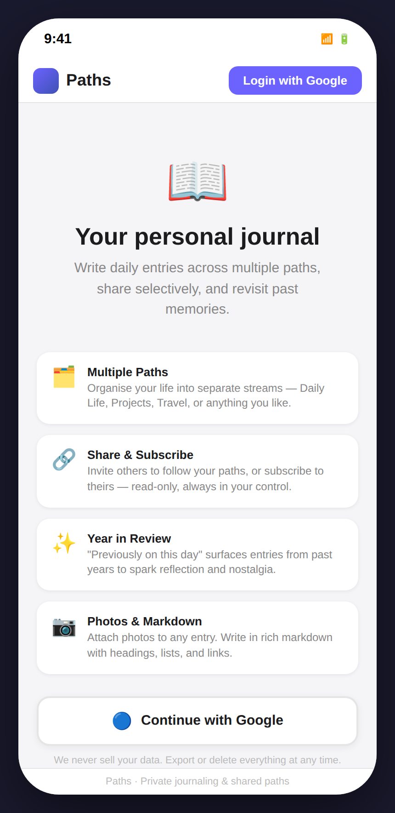
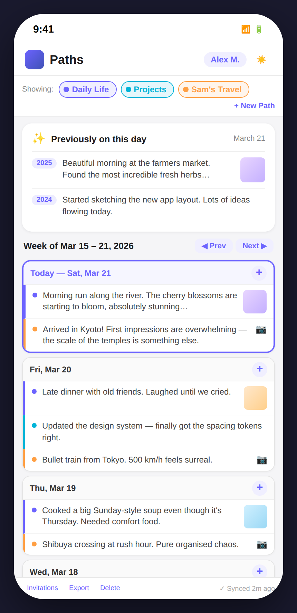
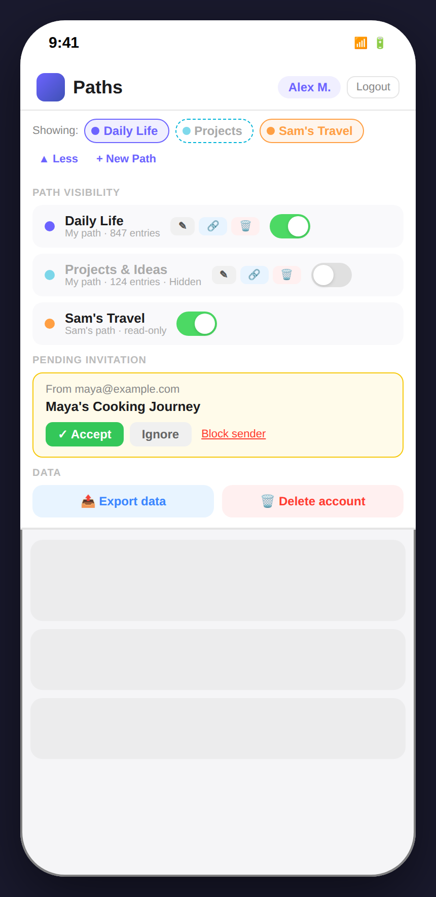
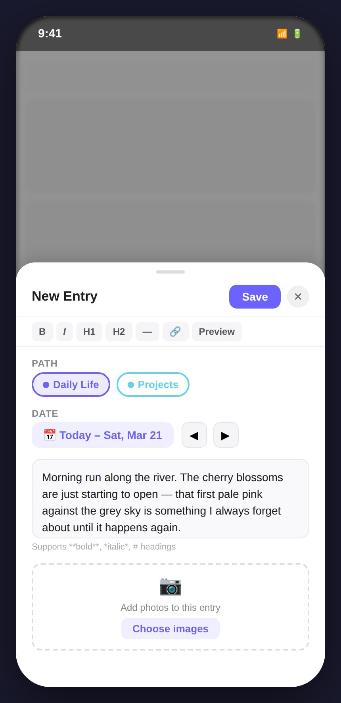

# Design A – Enhanced Week View

## Concept

Design A is an **evolutionary refinement** of the current interface. The structural bones remain familiar — a vertical list of day boxes, a paths selector bar above the content, and a persistent footer — but every detail is polished: colour-coded path chips, photo thumbnails inline in the day list, cleaner typography, and a richer "Previously on this day" card. This is the lowest-risk redesign: existing users would feel at home immediately.

---

## Screens

### 1 · Login / Welcome

**What this screen shows**

When the user is not logged in, Paths presents a simple welcome screen in place of the journal. The app logo and name are in the header alongside a prominent **Login with Google** button. The body lists four feature highlights (Multiple Paths, Share & Subscribe, Year in Review, Photos & Markdown) so a first-time visitor understands what they are signing up for.

**Functionality available**

- Single-tap Google OAuth login via the `Continue with Google` button
- Feature summary acts as onboarding copy

**Relationship to other screens**

After a successful OAuth callback the user lands on the [Home screen](#2--home-week-view). Until they are authenticated, no journal content is visible — the paths bar and week view are absent.

---

### 2 · Home – Week View

**What this screen shows**

The logged-in home screen. Three paths are shown simultaneously: **Daily Life** (purple), **Projects** (teal), and **Sam's Travel** (amber). The week of Mar 15–21 is laid out as a vertical stack of day boxes, with the most recent day (Today) at the top and highlighted in purple. Each entry inside a day box shows a coloured left-border, a path-colour dot, a text preview, and — when photos are attached — either an inline thumbnail or a 📷 camera badge.

Above the week list a **"Previously on this day"** spotlight card shows two past-year entries for March 21 (2025 with thumbnail, 2024 text-only) so the user always has year-over-year context without navigating away.

The paths selector bar lists all three paths as toggleable colour chips. The **Projects** chip is shown with a dashed border to indicate it is currently hidden from the feed (the toggle is off — see [Paths Management](#3--paths-management)).

**Functionality available**

- **Scroll** through the week; navigate to previous or next weeks via the ◀ Prev / Next ▶ buttons
- **Tap a day entry** to open the entry detail modal
- **Tap the + button** on any day header to open the entry creation modal pre-filled with that date
- **Toggle path visibility** by tapping a chip in the selector bar
- Dark/light mode via the ☀️ icon in the header; logout via the user chip area

**Relationship to other screens**

- Tapping + opens the [Entry Creation modal](#4--entry-creation)
- Tapping the "▲ Less / More" button in the paths bar expands the [Paths Management panel](#3--paths-management)
- The footer links navigate to separate Export and Delete confirmation views

---

### 3 · Paths Management

**What this screen shows**

The paths selector bar expanded into a full management panel, revealed by tapping **"▲ Less"** (the button flips from "More" when closed). The chip row stays visible at the top for quick scanning; below it a labelled **Path Visibility** section lists all three paths as rows, each with:

- A colour dot and name
- An entry count and owner note
- Edit ✎, Share 🔗, and Delete 🗑 action buttons (only for owned paths — Sam's Travel shows neither)
- An iOS-style on/off toggle — **Projects & Ideas** is shown hidden (toggle off, name greyed)

Below path visibility, a **Pending Invitation** card from `maya@example.com` offers Accept, Ignore, and Block sender. Finally a **Data** row with two side-by-side buttons: Export data (blue) and Delete account (red). The header retains the user chip and a Logout button.

**Functionality available**

- Toggle any path's visibility on or off (purely local — the server is unaffected)
- Edit a path's name, description, and colour via ✎
- Share a path with another user via 🔗 (opens a share modal)
- Delete a path permanently via 🗑 (destructive — confirmation required)
- Accept, Ignore, or Block sender for pending invitations
- Navigate to the full Export data flow
- Navigate to the account deletion confirmation

**Relationship to other screens**

The panel sits above the dimmed week view; collapsing it returns to the [Home screen](#2--home-week-view). The Export button and Delete button each navigate to their own dedicated views (separate routes in the current app: `/export` and `/delete`).

---

### 4 · Entry Creation

**What this screen shows**

A **bottom-sheet modal** slides up over the blurred home screen. The modal contains:

- **Path selector** — coloured chip buttons for the user's own writable paths (Daily Life selected; Projects dimmed as it is currently hidden)
- **Date field** — a date pill showing "Today – Sat, Mar 21" with left/right navigation arrows to select a different day without leaving the modal
- **Markdown toolbar** — B / I / H1 / H2 / — / Link / Preview buttons
- **Text area** — free-form entry text with markdown support; a hint below the textarea confirms supported syntax
- **Image upload area** — a dashed upload zone with a "Choose images" button

The modal header has **Save** (primary action, purple) and **✕** close button.

**Functionality available**

- Select which owned path the entry belongs to
- Navigate the date (previous / next day) without dismissing the modal
- Write content in markdown
- Format text using the inline toolbar
- Attach one or more photos
- Save the entry (POST to `/paths/{path_id}/entries`) or cancel

**Relationship to other screens**

On Save the modal dismisses and the home screen refreshes to show the new entry in the appropriate day box. On Cancel the user returns to wherever they tapped + — either the home screen's floating button or a specific day box's + button.

---

## Design character

| Quality              | Description                                                          |
| -------------------- | -------------------------------------------------------------------- |
| **Disruption level** | Low — familiar layout, incremental polish                            |
| **Year context**     | Spotlight card above the week; past-year entries visible at a glance |
| **Path management**  | Inline: expandable bar at the top of the page                        |
| **Entry creation**   | Bottom-sheet modal, accessible from the day + button or a global CTA |
| **Navigation model** | Single scrollable page; separate routes for Export and Delete        |
