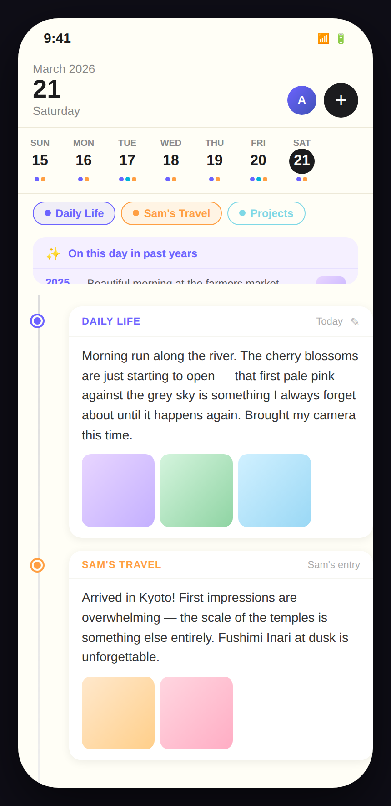
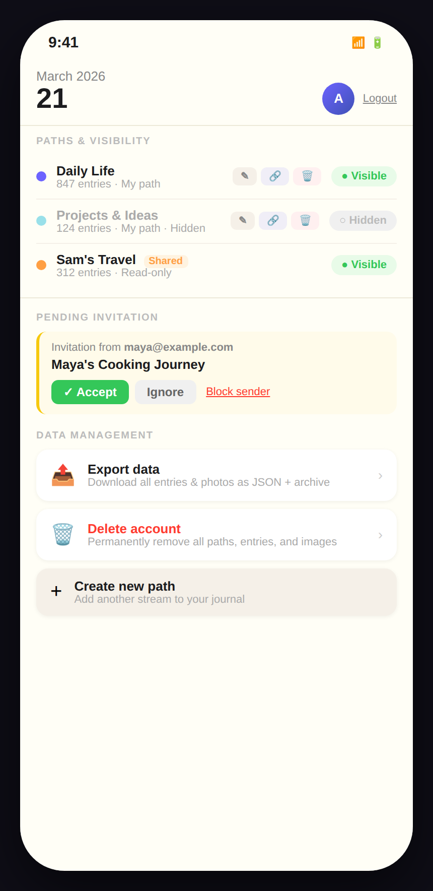
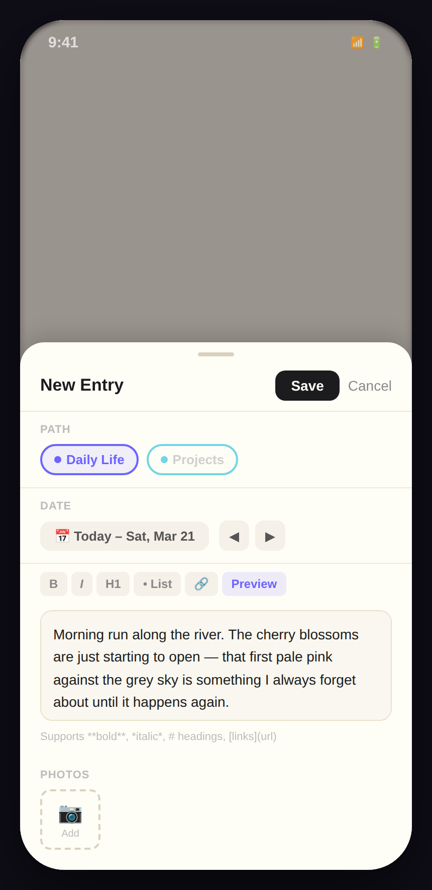

# Design B – Timeline Journal View

## Concept

Design B frames each day as a **living journal entry** rather than a calendar slot. The header gives the date the starring role (large date number, day name, month year). Below it a horizontal **day strip** — a scrollable row of 7 date slots with coloured dots showing which paths have entries — lets the user swipe across days with their thumb. Entries for the selected day appear as rich timeline cards on a warm cream background (`#fffef6`), evoking the feel of a physical notebook. A vertical timeline line on the left ties the cards together chronologically.

---

## Screens

### 1 · Main Day View

**What this screen shows**

The primary view for Saturday 21 March 2026. The header occupies the top quarter of the screen: a large **"21"** date, "Saturday" subtitle, and "March 2026" above it. The user's avatar and a **+** button for new entries sit in the top-right corner.

Immediately below the header is the **horizontal day strip**: each day of the current week shows a short day-name label, the date number, and a row of coloured dots — one per path that has an entry that day. Saturday is highlighted with an inverted (dark) date circle. Tapping any other day updates the timeline below.

Below the day strip, **path filter pills** allow the user to show or hide individual paths without leaving the main view.

The **"On this day in past years"** accordion appears at the top of the day's content — expanded by default — showing entries from 2025, 2024, and 2023, each with a year label, text preview, and optional thumbnail. This is the primary vehicle for year-over-year reflection.

Below the memories, the **timeline** shows today's entries as cards with a path-coloured dot on the left rail:

- **Daily Life** card: full text + three inline photo thumbnails (80 × 80 px)
- **Sam's Travel** card: full text + two thumbnails; labelled as "Sam's entry" (read-only; no edit button)

**Functionality available**

- Tap a day in the strip to jump to that day's timeline
- Tap a year memory entry to open its detail view
- Tap the ✎ edit button on an owned entry to open the entry edit modal
- Filter the timeline by tapping the path filter pills (toggles visibility locally)
- Tap **+** to open the entry creation modal

**Relationship to other screens**

- The **+** button in the header opens the [Entry Creation modal](#3--entry-creation)
- The path filter pills share state with the [Paths Management screen](#2--paths-management)
- Tapping a timeline entry opens its full detail / edit view

---

### 2 · Paths Management

**What this screen shows**

A dedicated management view (accessible from the header avatar menu or a settings icon). It uses the same warm cream palette as the main view. Three sections are shown:

**Paths & Visibility** — each path listed as a row:

- A colour dot
- Path name, entry count, and ownership note
- For owned paths: Edit ✎, Share 🔗, and Delete 🗑 action buttons
- A labelled "● Visible" / "○ Hidden" toggle pill; **Projects & Ideas** is shown hidden (muted name, "○ Hidden" pill)

**Pending Invitation** — a yellow-left-bordered card from `maya@example.com` offering Accept, Ignore, and Block sender actions.

**Data Management** — two tappable rows: Export data and Delete account, each with a description subtitle and a › chevron.

**Functionality available**

- Toggle path visibility (local only)
- Edit path metadata (name, description, colour)
- Share a path with another user
- Delete an owned path
- Unsubscribe from a shared path (implicit: Sam's Travel row has no delete button, only toggle)
- Accept / Ignore / Block a pending invitation
- Initiate a data export
- Initiate account deletion

**Relationship to other screens**

This view replaces the main day view (back navigation returns to [Day View](#1--main-day-view)). The path visibility toggles are reflected immediately in the day strip dots and timeline cards on return.

---

### 3 · Entry Creation

**What this screen shows**

A **bottom-sheet modal** slides up over the blurred day view. The modal's visual language (cream background, warm borders) matches the main view's notebook aesthetic.

- **Path selector** — chip buttons for owned writable paths (Daily Life selected; Projects dimmed because it is currently hidden)
- **Date** — a warm-toned pill showing "Today – Sat, Mar 21" with ◀ ▶ navigation; the date can be set to any day without dismissing the modal
- **Markdown toolbar** — B / I / H1 / • List / 🔗 / Preview
- **Text area** — styled with a warm parchment background and border to match the overall palette; placeholder shows markdown tip
- **Photos** — a compact "Add 📷" button; uploaded photos would appear as thumbnails in this row

The modal header has **Save** (dark button) and **Cancel**.

**Functionality available**

- Choose path, set date, write content in markdown, attach photos
- Preview rendered markdown before saving
- Save or cancel without losing in-progress content

**Relationship to other screens**

On Save the modal closes and the day strip updates to show a new dot for the relevant path on the saved date. The timeline cards for the current day refresh to include the new entry. On Cancel the user returns to the day view unchanged.

---

## Design character

| Quality              | Description                                                                           |
| -------------------- | ------------------------------------------------------------------------------------- |
| **Disruption level** | Medium — different layout pattern, familiar journal metaphors                         |
| **Year context**     | "On this day in past years" accordion always visible at top of day content            |
| **Path management**  | Dedicated screen (back navigation from main view)                                     |
| **Entry creation**   | Bottom-sheet modal matching the notebook visual language                              |
| **Navigation model** | Day-centric; horizontal swipe through days in the strip; separate screen for settings |
