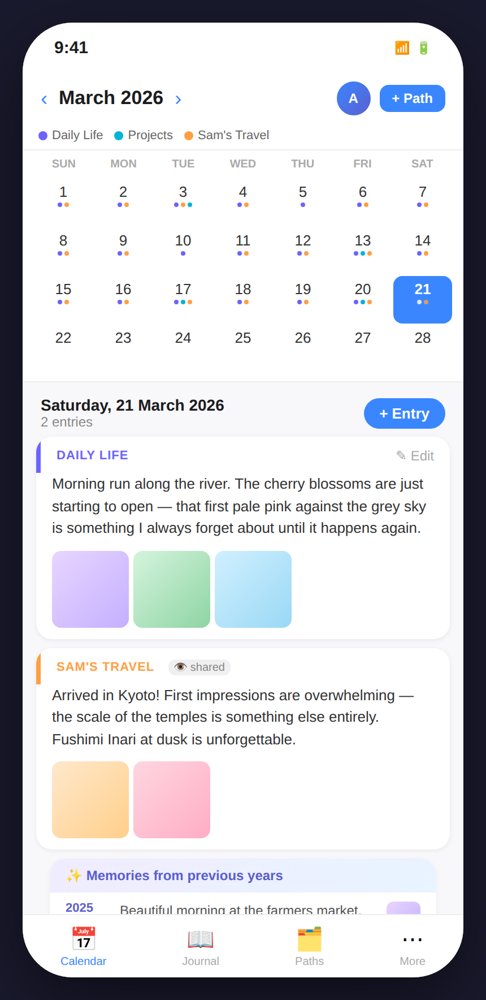
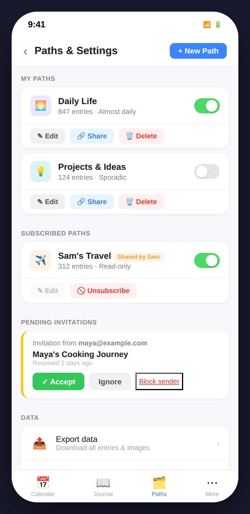
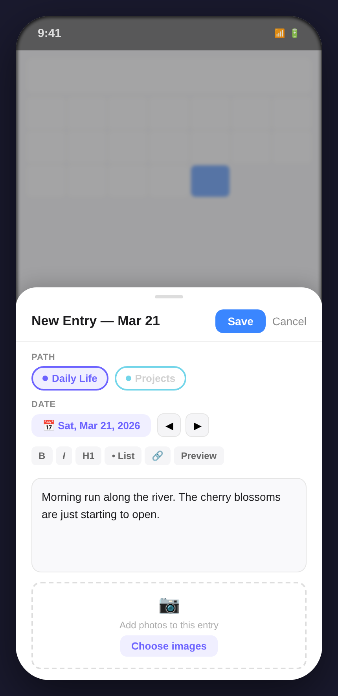

# Design C – Month Calendar + Day Panel

## Concept

Design C splits the screen into two zones: a **compact month calendar** at the top and a **scrollable day panel** below. Every day in the month grid is annotated with small coloured dots — one per path that has an entry — so the user can see at a glance how consistently they have written and which paths are most active. Tapping a day collapses the detail for the previous selection and expands the new one inline. A dedicated **Paths** tab in the bottom navigation bar brings all path management into a single organised screen. This design is especially effective for users who think of their journal in monthly rhythms.

---

## Screens

### 1 · Calendar View

**What this screen shows**

The primary view. The header shows the current month ("March 2026") with ‹ › month navigation arrows, the user avatar, and a "+ Path" button for quick path creation.

A **colour legend** just below the header maps each path to its dot colour (purple for Daily Life, teal for Projects, amber for Sam's Travel), so the calendar is immediately interpretable without needing to hover or tap.

The **month grid** displays all 31 days in a standard 7-column layout. Under each date number, up to three coloured dots indicate which paths have entries that day. Dense days (like the 3rd, 13th, 17th) show three dots; days with a single entry show one; future empty days have none. Saturday the 21st (today) is selected — its cell is filled blue.

Below the calendar the **day panel** is anchored to the selected date. It shows:

- A header: "Saturday, 21 March 2026 — 2 entries" with a "+ Entry" button
- An entry card for **Daily Life** — left-bordered in purple — with the entry text and three photo thumbnails
- An entry card for **Sam's Travel** — left-bordered in amber — with a 👁 "shared" badge (no edit button), text, and two thumbnails
- A "Memories from previous years" accordion listing 2025 (with thumbnail) and 2024 past entries

**Functionality available**

- Navigate months with ‹ and ›
- Select any day to see its entries in the panel below
- Tap an entry card to expand it or open the detail view
- Edit an owned entry via the "✎ Edit" button (only shown for owned paths)
- Tap "+ Entry" in the day panel header to open the entry creation modal for that date
- Scroll the day panel independently of the calendar

**Relationship to other screens**

- Tapping "+ Entry" opens the [Entry Creation modal](#3--entry-creation)
- Tapping the **Paths** tab in the bottom nav goes to [Paths Management](#2--paths-management)
- The dots in the calendar grid reflect the current path visibility settings

---

### 2 · Paths Management

**What this screen shows**

The **Paths** tab (third item in the bottom navigation bar). All path management lives here — there is no floating panel or expanded bar. The tab has three sections:

**My Paths**
Two owned paths as cards:

- Each card shows a colour swatch emoji, name, entry count, and cadence note
- An iOS-style toggle switch controls visibility
- Action buttons (Edit, Share, Delete) are shown for owned paths
- **Projects & Ideas** has its toggle in the off position — its name is greyed out to reinforce the hidden state

**Subscribed Paths**
Sam's Travel is shown as a card with a "Shared by Sam" badge. Only an Unsubscribe button is available (no edit or delete).

**Pending Invitations**
An invitation card from `maya@example.com` for "Maya's Cooking Journey" with Accept, Ignore, and Block sender buttons. The yellow-left-border styling makes pending actions immediately recognisable.

**Data**
A grouped list row with two tappable items: Export data (with description "Download all entries & images") and Delete account (with red label and "Permanently erase all data").

**Functionality available**

- Show or hide any path with a toggle switch (local only — server is not affected)
- Edit path name, colour, and description
- Share a path (opens invite modal)
- Delete an owned path (with confirmation)
- Unsubscribe from a shared path
- Accept / Ignore / Block an invitation
- Export all data as JSON + image archive
- Initiate account deletion

**Relationship to other screens**

Returning to the Calendar or Journal tabs restores the main view. Path visibility changes are immediately reflected in the calendar dot counts and the day panel entries.

---

### 3 · Entry Creation

**What this screen shows**

A **bottom-sheet modal** layered over the blurred calendar. The selected day (21) is visible through the blur in the background — a gentle reminder of the context.

The modal contains:

- A **title** "New Entry — Mar 21" with Save (blue) and Cancel buttons
- **Path selector** chips — Daily Life selected; Projects dimmed (it is currently hidden)
- **Date** row — pill showing the pre-filled date, with ◀ ▶ arrows to change the day without closing the modal
- **Markdown toolbar** — B / I / H1 / • List / 🔗 / Preview
- **Text area** — pre-filled with a sample entry; large enough to write comfortably
- **Image upload** — dashed upload zone with a "Choose images" button

**Functionality available**

- Change the path or date without dismissing the modal
- Write and format content with markdown
- Preview the rendered result
- Attach one or more photos
- Save or cancel

**Relationship to other screens**

After saving, the modal closes and the calendar grid updates to show a new dot on the selected day for the chosen path. The day panel below the calendar refreshes to include the new entry card. The year comparison in the day panel is unaffected by new entries.

---

## Design character

| Quality              | Description                                                                         |
| -------------------- | ----------------------------------------------------------------------------------- |
| **Disruption level** | Medium — new layout, but familiar calendar metaphor                                 |
| **Year context**     | "Memories from previous years" card inside the day panel                            |
| **Path management**  | Dedicated "Paths" tab in bottom navigation — fully separate from the journal        |
| **Entry creation**   | Bottom-sheet modal opened from the day panel "+ Entry" button or calendar day tap   |
| **Navigation model** | Bottom tab bar (Calendar / Journal / Paths / More); month grid drives day selection |
