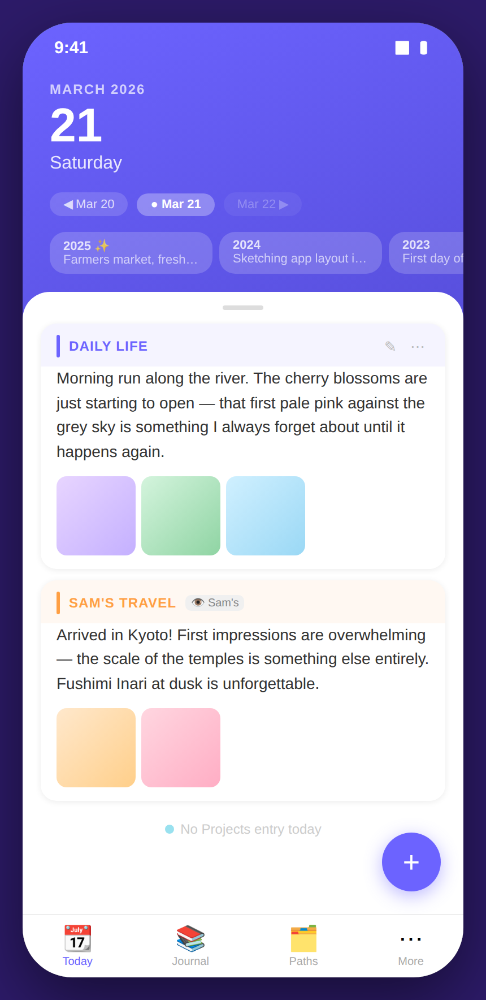
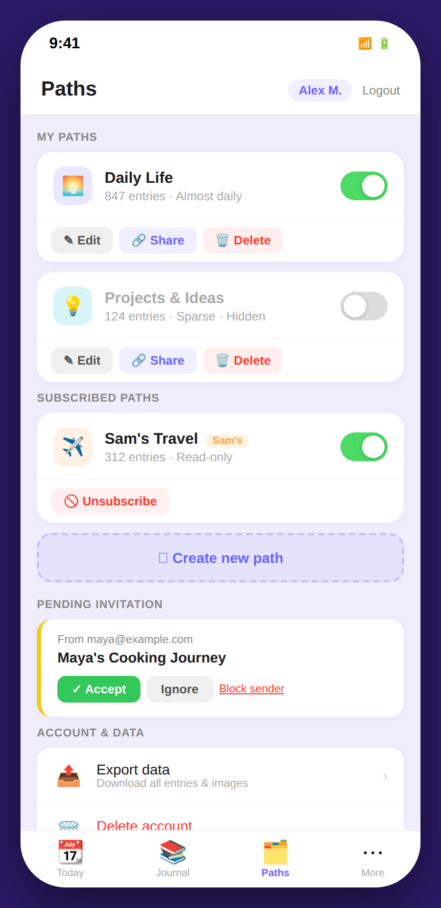
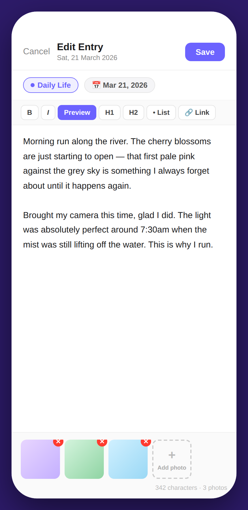

# Design D – Full-Screen Day Cards

## Concept

Design D gives the current day an **immersive, full-bleed presence**. A gradient hero card (deep indigo to violet) fills the top two-thirds of the screen, displaying the date in bold white type. The user swipes horizontally through days — a gesture familiar from calendar apps — with the previous and next day peeking in from the sides. Year context is shown as a row of horizontally scrollable **year chips** on the hero card itself, so the user can compare the same date across multiple years without leaving the current view. Entry content appears in a white rounded-bottom-sheet that slides up, keeping the date hero always partially visible. A floating **+** button (FAB) is the primary action trigger. All path management lives in a dedicated "Paths" tab in the bottom navigation bar.

---

## Screens

### 1 · Today View

**What this screen shows**

The hero section (top portion) shows:

- "MARCH 2026" in uppercase caption
- A large **"21"** date
- "Saturday" subtitle
- **Day navigation pills**: ◀ Mar 20 · ● Mar 21 · Mar 22 ▶ — tapping these or swiping navigates days
- **Year context chips**: "2025 ✨ · Farmers market, fresh…", "2024 · Sketching app layout…", "2023 · First day of spring" — each chip is tappable to reveal that year's full entry

The previous day's card (Mar 20) is visible as a blurred blue sliver on the left, reinforcing the swipe navigation model.

Below the hero the white bottom sheet (draggable up for full-screen reading) contains:

- **Daily Life** section: purple header bar, entry text, and three photo thumbnails; ✎ and ⋯ action buttons
- **Sam's Travel** section: amber header bar, "👁 Sam's" badge (read-only), entry text, and two thumbnails
- A ghost row "● No Projects entry today" — keeps all paths permanently visible so the user always knows which paths are inactive on a given day

The **floating + button** (purple circle, lower right) is always accessible above the bottom navigation.

**Functionality available**

- Swipe left/right or tap the nav pills to move between days
- Drag the bottom sheet up to read entries in full-screen
- Tap a year chip to expand that year's entry inline
- Tap ✎ to edit an owned entry (opens the [Entry Edit modal](#3--entry-edit))
- Tap ⋯ for more options (delete, change path)
- Tap + FAB to create a new entry (opens the edit modal with blank content)

**Relationship to other screens**

- The + FAB opens the [Entry Edit modal](#3--entry-edit)
- The **Paths** tab in the bottom nav opens [Paths Management](#2--paths-management)
- The year chips surface historical entries without navigating away

---

### 2 · Paths Management

**What this screen shows**

The **Paths** tab (third item in the bottom nav). The page header shows the title "Paths" with the user chip and Logout link.

**My Paths** — two cards:

- **Daily Life**: swatch + name + entry count + cadence; toggle (on); Edit ✎ / Share 🔗 / Delete 🗑 buttons
- **Projects & Ideas**: toggle is off; name is muted grey; same action buttons available

**Subscribed Paths** — one card:

- **Sam's Travel**: amber swatch + "Sam's" badge; toggle on; only "🚫 Unsubscribe" button (no edit/delete)

A dashed **"＋ Create new path"** call-to-action button below the subscribed paths opens a path creation flow.

**Pending Invitation** — card from `maya@example.com` for "Maya's Cooking Journey" with Accept / Ignore / Block sender.

**Account & Data** — grouped list: Export data (with description) and Delete account (red label with description).

**Functionality available**

- Toggle visibility of each path (local only)
- Edit, share, or delete owned paths
- Unsubscribe from a shared path
- Create a new path via the dashed button
- Accept, ignore, or block invitations
- Export data or delete the account

**Relationship to other screens**

Returning to the **Today** tab takes the user back to the [Today View](#1--today-view). Visibility changes are immediately reflected: the bottom-sheet sections on the day card show only paths that are currently visible, and hidden paths appear as ghost "No entry today" rows.

---

### 3 · Entry Edit

**What this screen shows**

A **full-screen modal** (not a bottom sheet) for writing and editing entries. The full-screen treatment gives maximum writing space on a phone — no partial overlays, no visual noise from the day card behind.

- Header: Cancel (plain text) | "Edit Entry — Sat, 21 March 2026" | **Save** (purple button)
- **Path badge** — a coloured pill showing the path name (Daily Life, purple); tapping it changes the path
- **Date badge** — showing "📅 Mar 21, 2026"; tapping opens a date picker
- **Markdown toolbar** — B / I / Preview (highlighted) / H1 / H2 / • List / 🔗 Link
- **Editor area** — the full text of the entry; a serif-weight content area styled for comfortable reading and editing; cursor is positioned at the end of existing content
- **Photos** — a row of three existing thumbnails each with a ✕ remove button, followed by an "Add photo +" slot
- A **character count** at the bottom right ("342 characters · 3 photos")

**Functionality available**

- Switch the entry to a different path (change path badge)
- Change the entry date
- Write or edit content with markdown; switch to preview to see rendered output
- Add or remove photos
- Save or cancel (Cancel with unsaved changes prompts a discard confirmation)

**Relationship to other screens**

On Save the modal closes and the Today card refreshes with the updated entry. On Cancel the user returns to the [Today View](#1--today-view). The same full-screen modal is used for both creating new entries (opened via the + FAB) and editing existing ones (opened via the ✎ button inside an entry section).

---

## Design character

| Quality                   | Description                                                                       |
| ------------------------- | --------------------------------------------------------------------------------- |
| **Disruption level**      | High — visually distinctive; new interaction paradigm (swipe days)                |
| **Year context**          | Year chips permanently displayed on the hero card for the current date            |
| **Path management**       | Dedicated "Paths" tab in bottom navigation                                        |
| **Entry creation / edit** | Full-screen modal; same view for create and edit                                  |
| **Navigation model**      | Bottom tab bar (Today / Journal / Paths / More); day navigation by swipe or pills |
