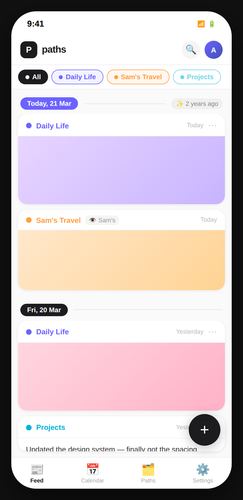
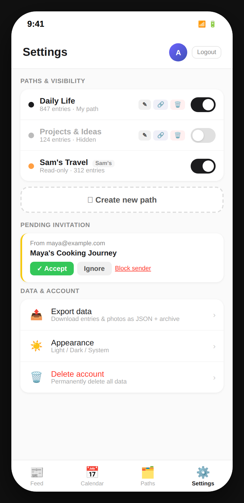
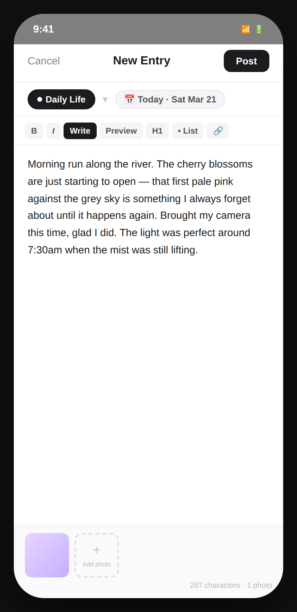

# Design E – Chronological Entry Stream

## Concept

Design E reimagines Paths as an **activity feed** — the format users know intimately from social apps. Entries flow newest-first in an infinite scroll. Photos are shown as full-width hero images rather than small thumbnails, making photo-heavy paths like Daily Life and Sam's Travel feel vivid and immediately engaging. **Date group headers** act as anchors, and their "✨ N years ago" badge provides year-over-year context without a separate "On this day" card. A bottom tab bar provides navigation between the Feed, a Calendar view (for date-specific browsing), Paths management, and Settings. A floating **+** button creates new entries from the feed. This design is best for users who experience their journal chronologically rather than date-first.

---

## Screens

### 1 · Feed View

**What this screen shows**

The primary view. The header shows the **Paths** wordmark and logo, a search icon, and the user avatar.

Immediately below the header is a **path filter chip row** (horizontally scrollable): "All" (dark, currently selected), "Daily Life" (purple), "Sam's Travel" (amber), and "Projects" (teal, dimmed because it is currently hidden). Tapping any chip toggles filtering — the feed instantly shows only entries from the selected paths.

Below the filter row, entries flow in reverse-chronological groups:

**Today, 21 Mar** group header — carries a "✨ 2 years ago" badge indicating that past entries exist on this date.

1. **Daily Life** entry card: path dot + name + "Today" timestamp + ⋯ menu. A full-width hero photo tile (gradient placeholder) fills the card, with a "📷 3 photos" badge in the bottom-right corner. Two lines of entry text follow, then Edit and Bookmark action buttons.

2. **Sam's Travel** entry card: path dot + name + "👁 Sam's" shared badge + "Today" timestamp. Full-width hero photo, "📷 2 photos" badge, entry text. No edit button (read-only).

**Fri, 20 Mar** group header (no year badge — no past entries on this date).

3. **Daily Life** entry (yesterday): hero photo + text + Edit button.

4. **Projects** entry (yesterday): text-only card (no photo hero) + Edit button.

**Functionality available**

- Infinite scroll through all entries across all visible paths
- Filter the feed by path using the chip row
- Tap a hero photo to open the full-screen photo viewer
- Edit an owned entry via the action buttons
- Delete an owned entry via the ⋯ overflow menu
- Search entries via the search icon in the header
- Tap the "✨ N years ago" badge on a date group header to expand past-year entries inline

**Relationship to other screens**

- The + FAB opens the [Entry Creation modal](#3--entry-creation)
- The **Settings** tab opens [Settings](#2--settings)
- The Calendar tab takes the user to a month-grid view for date-specific browsing (not shown separately — same pattern as Design C)

---

### 2 · Settings

**What this screen shows**

The **Settings** tab (fourth item in the bottom nav). The header shows "Settings" with the user avatar and Logout button.

**Paths & Visibility** — a grouped card listing all three paths:

- Each path has a dot, name, and entry count
- Owned paths show Edit ✎ / Share 🔗 / Delete 🗑 buttons
- Each path has an iOS toggle switch — **Projects & Ideas** is off (hidden from feed) and shown with a muted name
- Sam's Travel shows only a toggle switch (no edit/delete — read-only)

A dashed **"＋ Create new path"** full-width button appears below the paths list.

**Pending Invitation** — card from `maya@example.com` for "Maya's Cooking Journey" with Accept / Ignore / Block sender.

**Data & Account** — a grouped settings list:

- Export data (with description "Download entries & photos as JSON + archive")
- Appearance (Light / Dark / System theme selector)
- Delete account (red label, "Permanently delete all data")

**Functionality available**

- Toggle path visibility (local only — feed updates immediately on return)
- Edit path metadata or share a path
- Delete an owned path (confirmation required)
- Create a new path
- Accept / ignore / block an invitation
- Export all data
- Change the app's colour theme
- Delete the account

**Relationship to other screens**

Navigating back to the **Feed** tab reflects the updated path visibility — hidden paths disappear from the feed and their filter chips become dimmed. The "+ Create new path" button opens a path creation sheet (inline). Export data navigates to a dedicated export status view.

---

### 3 · Entry Creation

**What this screen shows**

A **full-screen overlay** for entry creation, opened by tapping the + FAB. It covers the entire viewport — the feed behind it is dimmed and blurred but not navigated away from. Because it fills the screen completely it offers the same writing space as a dedicated page, while remaining dismissible with Cancel.

- Header: Cancel (plain text) | **"New Entry"** title | **Post** button (dark)
- **Path badge** — dark pill with white dot showing "Daily Life"; a ▼ dropdown indicator lets the user change paths
- **Date badge** — "📅 Today · Sat Mar 21"; tappable to change date
- **Markdown toolbar** — B / I / Write (highlighted as active) / Preview / H1 / • List / 🔗
- **Editor** — full-screen white area with the entry text; large comfortable reading/writing size
- **Photos footer** — a thumbnail of the first attached photo plus a "+ Add photo" dashed slot; character count and photo count shown bottom-right ("287 characters · 1 photo")

**Functionality available**

- Select path (tap badge to change)
- Set date (tap date badge)
- Write in markdown; switch between Write and Preview modes
- Attach photos (thumbnails appear in the footer row)
- Post (save) or Cancel
- Cancel with unsaved changes prompts a discard confirmation

**Relationship to other screens**

On Post, the new entry appears at the top of the feed under a "Today" date group header (or inserts into the appropriate date group if backdated). The Feed scrolls or jumps to show the newly created entry. The path filter chips update if the chosen path was previously hidden.

---

## Design character

| Quality              | Description                                                                        |
| -------------------- | ---------------------------------------------------------------------------------- |
| **Disruption level** | Medium–high — feed paradigm is unfamiliar for a journal, but widely understood     |
| **Year context**     | "N years ago" badge on date group headers; inline expansion on tap                 |
| **Path management**  | Dedicated Settings tab in bottom navigation                                        |
| **Entry creation**   | Full-screen modal opened from FAB                                                  |
| **Navigation model** | Bottom tab bar (Feed / Calendar / Paths / Settings); feed is reverse-chronological |
