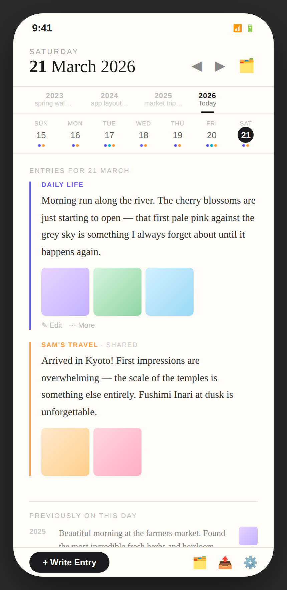
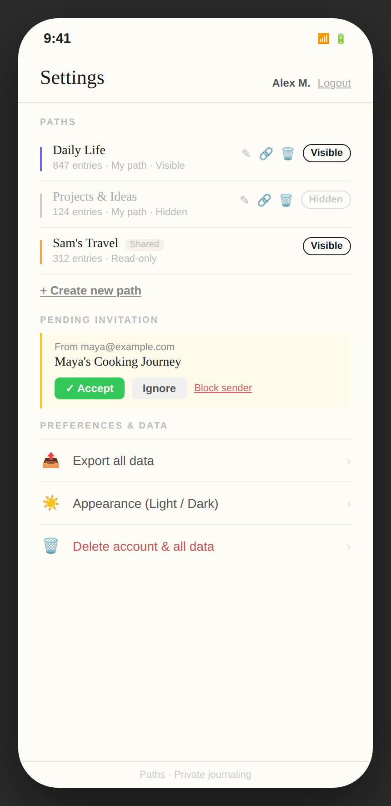
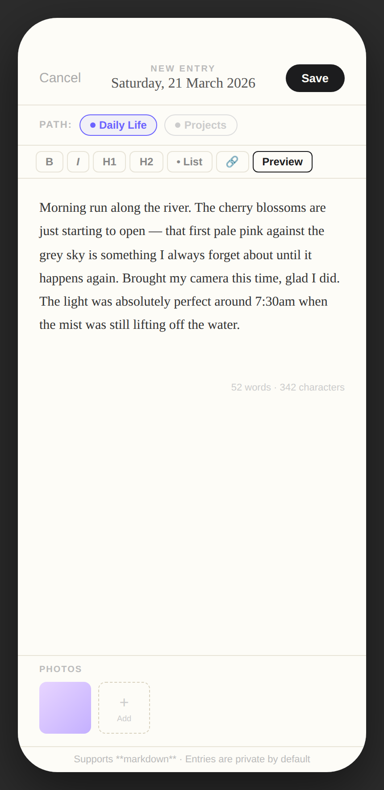

# Design F – Zen Minimalist

## Concept

Design F strips the interface back to its essence: **words on paper**. It uses a traditional serif font (Georgia / Times New Roman), a warm paper-white background (`#fdfcf7`), and a thin 2 px coloured left border on entries rather than cards, backgrounds, or bold UI chrome. Navigation is text-first: a row of **year tabs** across the top lets the user jump directly to the same date in any past year for immediate comparison. A compact **week mini-bar** shows the current week's entry activity without taking up much space. The overall feeling is more like a printed journal or memoir than a mobile app. This design would appeal to users who value calm, distraction-free writing above all else.

---

## Screens

### 1 · Main Journal View

**What this screen shows**

The primary view for Saturday, 21 March 2026.

**Header** (top section): the day name in uppercase small caps ("SATURDAY"), followed by the full date in a large but light-weight serif font ("**21** March 2026"). Navigation arrows (◀ ▶) on the right step through days; the 🗂️ icon opens the [Settings panel](#2--settings).

**Year navigation tabs**: a horizontal tab row listing years with past entries — 2023 / 2024 / 2025 / **2026** (active, underlined). Each tab shows a small preview of that year's entry for the current date ("spring walk…", "app layout…", "market trip…"). Tapping a year tab swaps the content area to show that year's entries for the same date, enabling direct year-on-year comparison.

**Week mini-bar**: a single row of 7 day cells (Sun–Sat, 15–21). Each shows the day abbreviation, date number, and a row of small coloured dots indicating which paths have entries. Today (Sat 21) has an inverted (dark circle) date badge. This compact bar gives context for the week's activity without dominating the screen.

**Entries for 21 March** (section heading in uppercase small caps):

1. **Daily Life** entry — a 2 px purple left border, "DAILY LIFE" label in uppercase, entry text in readable 15 px serif, three photo thumbnails, and subtle ✎ Edit / ⋯ More action links below the entry.

2. **Sam's Travel** entry — amber left border, "SAM'S TRAVEL · Shared" label (no edit action), entry text, two photo thumbnails.

**Previously on this day** (section heading, below a thin rule): a compact list of past-year memories with grey year labels (2025 with thumbnail, 2024 and 2023 text-only), preserving the reflective character of the design.

**Footer**: a "+ Write Entry" pill button on the left (opens the [Compose view](#3--entry-creation)), three icon buttons on the right for paths/settings, export, and app preferences.

**Functionality available**

- Tap year tabs to compare the same date across years
- Navigate days with the ◀ ▶ arrows in the header
- Tap a week mini-bar day to jump to that date
- Tap ✎ Edit to open the [Compose view](#3--entry-creation) for an owned entry
- Tap ⋯ More for delete and path-change options
- Tap "+ Write Entry" to create a new entry for the current date
- Tap 🗂️ to open Settings

**Relationship to other screens**

- The "+ Write Entry" button and ✎ Edit link both open the [Compose view](#3--entry-creation)
- The 🗂️ icon opens the [Settings panel](#2--settings)
- Year tab navigation swaps out all entry content for the selected year while keeping the date header and week mini-bar fixed

---

### 2 · Settings

**What this screen shows**

A full-page settings view accessed via the 🗂️ icon in the main view's header or the settings footer icon. The page respects the serif, paper-white aesthetic throughout.

**Header**: "Settings" in large light-weight serif, with the user name and Logout link in a smaller sans-serif caption.

**Paths** section — three entry rows, each with:

- A 2 px coloured left bar (matching the journal's entry style)
- Path name in serif, entry count and ownership note in small sans-serif caption
- Edit ✎ / Share 🔗 / Delete 🗑 icon buttons for owned paths
- A pill toggle labelled "Visible" (filled border, dark) or "Hidden" (outline, grey)
- **Projects & Ideas** is shown hidden — muted path name, grey left bar, "Hidden" toggle
- **Sam's Travel** shows only a "Visible" toggle (no edit/share/delete — read-only)

Below the paths a **"+ Create new path"** underlined link (light, lowercase).

**Pending Invitation** section — yellow-left-bordered card from `maya@example.com` for "Maya's Cooking Journey" with Accept / Ignore / Block sender buttons.

**Preferences & Data** section — a minimal list:

- Export all data (› chevron)
- Appearance — Light / Dark (›)
- Delete account & all data (shown in muted red, ›)

**Functionality available**

- Toggle path visibility (Visible / Hidden)
- Edit path name, description, colour
- Share a path (invite by email)
- Delete an owned path
- Accept / ignore / block a pending invitation
- Export all data as portable JSON + image archive
- Switch between light and dark appearance
- Delete the account and all associated data

**Relationship to other screens**

Returning from Settings (back navigation or tap outside) restores the main journal view with updated visibility — hidden paths' entries are omitted from the day's content and their dots are absent from the week mini-bar. Path visibility changes also hide that path's year tabs from the year navigation row.

---

### 3 · Entry Creation (Compose)

**What this screen shows**

A **full-screen compose view** — not a modal sheet, but a complete replacement of the journal view. This maintains the zen, distraction-free writing environment.

**Header**: Cancel (plain text) | centred title block ("New entry" in small-caps label + "Saturday, 21 March 2026" date) | **Save** button (dark rounded pill).

**Path bar**: a single row listing the writable paths as small labelled pills — Daily Life (selected, purple pill) and Projects & Ideas (unselected, grey dashed border). Tapping switches paths.

**Zen toolbar**: a minimal row of formatting buttons with thin bordered pills — B / I / H1 / H2 / • List / 🔗 / Preview. The toolbar blends into the parchment background rather than drawing attention to itself.

**Writing area**: the full remaining height of the screen. The entry text is shown in 15 px serif with 1.75 line-height — optimised for comfortable long-form writing. A blinking cursor is visible at the end of the text. A small word and character count sits at the bottom-right of the writing area.

**Photos**: a compact footer section (separate from the writing area by a thin rule) showing the path-label heading, a thumbnail of any attached photo, and a "+ Add" dashed slot.

**Footer hint**: "Supports **markdown** · Entries are private by default" — a quiet reminder.

**Functionality available**

- Switch path (tap path pills)
- Write long-form content in a calm, distraction-free environment
- Apply markdown formatting via the zen toolbar
- Toggle Preview to see rendered markdown
- Attach photos (appear as thumbnails; tap to remove)
- Save (POST new entry) or Cancel (returns to journal view; prompts if unsaved content exists)

**Relationship to other screens**

On Save the compose view closes and the journal view refreshes. If the entry was saved for today's date the year tab navigation now shows "2026 · Today" with the first few words of the new entry as its preview. If the entry was backdated it appears in the day view when the user navigates to that date. The writing environment has no distracting navigation chrome — the only route out is Save or Cancel.

---

## Design character

| Quality              | Description                                                                                                                  |
| -------------------- | ---------------------------------------------------------------------------------------------------------------------------- |
| **Disruption level** | High — serif fonts, paper palette, and editorial layout feel unlike any common mobile app                                    |
| **Year context**     | Year navigation tabs directly above the entries; tapping any year shows that year's content inline                           |
| **Path management**  | Settings page accessed from header icon or footer; paths shown as editorial list with minimal chrome                         |
| **Entry creation**   | Full-screen compose view replacing the journal view entirely                                                                 |
| **Navigation model** | Day-centric with ◀ ▶ arrows; week mini-bar for week overview; year tabs for year comparison; no persistent bottom navigation |
